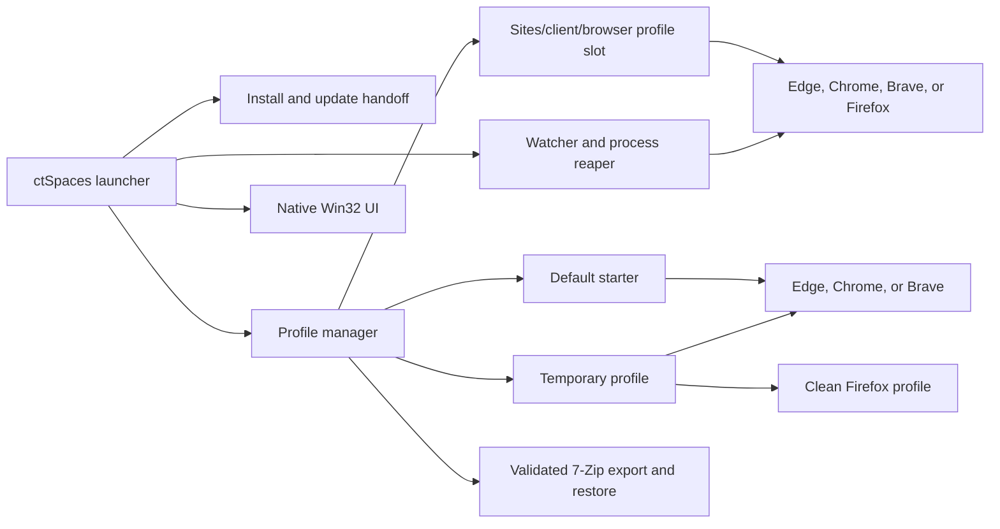

# Developer Guide

Applies to ctSpaces 5.3.

## Technology

ctSpaces is a native 64-bit Windows desktop application written in C++20 with the Win32 API. It uses the Visual Studio v145 toolset, the Windows SDK, static C/C++ runtime linkage, GDI/GDI+ drawing, common controls, DWM title-bar styling, shell APIs, and a bundled static 7-Zip 26.02 library.

The output executable is self-contained. There is no application framework, package manager, service, web frontend, or external runtime installer.

## Source Map

| Path | Responsibility |
|---|---|
| `ctSpaces.cpp` | Startup, installer/update flow, launcher UI, themes, profile lifecycle, browser launch/tracking, icons, backup/restore, and dialogs |
| `ctSpaces.rc` | Icons, dialog resources, embedded `Default.7z`, embedded runtime sanitizer, and Windows version metadata |
| `Resource.h` | Resource identifiers |
| `version.h` | Single version source for app, About, file, and product versions |
| `theme.h` | Built-in named theme catalog |
| `InProc7z.*` | In-process extraction/compression wrapper for the starter template |
| `BrowserPreferencesJson.*` | Bounded Chromium Preferences parsing and staged startup-preference mutation |
| `ConfigPersistence.*` | Tri-state configuration inspection and atomic sibling-stage mutations |
| `ProgressUI.*` | Themed progress-window helpers |
| `Default.7z` | Sanitized starter browser profile embedded into the executable |
| `3p\7zip` | Official 7-Zip 26.02 source at tag `26.02` / commit `f9d78aff31a5f2521ae7ddbdc97c4a8855808959` |
| `7zip\Format7z.vcxproj` | Static 7-Zip library project |
| `tools\Sanitize-DefaultProfileDirectory.ps1` | Shared runtime/build-time allowlist that sanitizes an extracted Default profile and proof-prunes Favicons with System32 `winsqlite3.dll` |
| `tools\Sanitize-DefaultProfile.ps1` | Build-time archive wrapper that uses validated System32 tar, preflights entry paths/types/declared sizes, rejects unsafe extracted items, delegates to the shared sanitizer, and atomically commits a verified starter archive |
| `tests\Test-DefaultProfileSanitizer.ps1` | Injected private-state and allowlisted-configuration sanitizer test |
| `tests\Test-DefaultProfileArchiveSanitizer.ps1` | Archive traversal, collision, type, size, reparse, and atomic-commit sanitizer test |
| `tests\Test-ConfigPersistence.ps1` | Compiled tri-state/atomic configuration persistence test |
| `tests\Test-BrowserPreferencesJson.ps1` | Compiled Preferences parser and mutation test |
| `tests\Test-Release.ps1` | Version, artifact, starter-content, and privacy checks |
| `BackupEngine.*` | Manifested backup creation, validation, staging, and transactional restore |
| `tests\Test-ArchiveRoundTrip.ps1` | Compiled archive and backup/restore integrity integration test |
| `tests\Test-LiveIconRefresh.ps1` | Same-window live browser-icon and real-shortcut AppID-separation integration test |
| `tests\Test-AutoFetchDialogLayout.ps1` | DPI/layout/theme-path check for the Auto-fetch dialog |
| `tests\Test-WorkflowFeatures.ps1` | Isolated pin, shortcut, rename, archive/restore, and title-preference workflow test |
| `tests\Test-RenameShortcutTransactions.ps1` | Static gate for bounded rename stages, symmetric case-only rollback, phase-safe rename/archive commits, and ownership-bound shortcut transactions |
| `tests\Test-HandleBoundRename.ps1` | Native race/no-overwrite test for handle-bound shortcut rename transactions |
| `tests\Test-ClientShortcutName.ps1` | Compiled boundary test for canonical client-only and historical shortcut filenames, path limits, case folding, and UTF-16 safety |
| `tests\Test-RestoreTabsToggle.ps1` | Isolated per-client/browser Restore-tabs UI and persistence test |
| `tests\Test-ExternalBrowserProfileUse.ps1` | Harmless fake-browser test for OS-level profile-use blocking during archive and all-Sites export |
| `tests\Test-SameClientMultiBrowser.ps1` | Simultaneous Edge/Chrome test for one client's two isolated browser slots |
| `tests\Test-CoordinatedShutdown.ps1` | Disposable Chromium session-ending behavior test |
| `tests\Test-RestoreAfterBrowserClose.ps1` | Disposable local-tab restore, profile-release, and client-first title integration test |
| `docs\DEVELOPER_GUIDE.md` | Public architecture, testing, and release procedures |
| `docs\RELEASE_VALIDATION_*.md` | Versioned validation evidence and explicitly retained boundaries |

## Runtime Architecture



## Startup Flow

1. Apply QA-path isolation when explicitly requested, wait for a prior updater PID when `--wait-for-pid` is present, and resolve the per-user runtime identity.
2. Acquire the per-user/session `Local\...` single-instance mutex before configuration-driven startup work; fail closed if it cannot be established.
3. Bring an existing identity-verified launcher forward through acknowledged IPC or report a different running executable.
4. Initialize COM and per-monitor DPI awareness, resolve `%LOCALAPPDATA%\InfinitySys\ctSpaces`, and load the built-in theme catalog.
5. Read the saved theme, title preference, archived clients, pinned order, Restore tabs exceptions, and default browser from `config.ini` using tri-state configuration inspection.
6. Run directly when `ctSpaces.portable` is beside the executable; otherwise enter install/update handoff.
7. Detect supported Edge, Chrome, Brave, and Firefox installations and resolve the saved default browser.
8. Transactionally install or revise the embedded starter template.
9. Initialize common controls, GDI+, ProgressUI, in-process 7-Zip, themes, and the launcher window with checked failure paths.
10. Enter the standard Win32 message loop.

## Profile Lifecycle

### Standard Client

The active identity is `(case-insensitive client name, browser kind)`. `LaunchProfileAsync` creates a missing Chromium slot from `Default.7z` or a missing Firefox slot as a clean Firefox profile, clears startup/session state as appropriate for that browser family, and launches the selected browser with its dedicated profile path. Existing slots receive restore behavior unless that client/browser pair's `Restore tabs` preference is off; new slots never restore starter state.

New clients use the v2 layout:

```text
Sites\<ClientName>\ctSpaces-client-v2
Sites\<ClientName>\Browsers\edge\Profile
Sites\<ClientName>\Browsers\chrome\Profile
Sites\<ClientName>\Browsers\brave\Profile
Sites\<ClientName>\Browsers\firefox\Profile
```

A legacy client root remains the original Chromium `--user-data-dir`; private data is never moved into the v2 tree as an automatic migration. The durable `ctSpaces-legacy-browser-v2` marker binds that root to the first selected Chromium browser. Selecting Firefox first creates only its nested slot and leaves the legacy root unbound until a Chromium selection. Later browsers get clean nested slots.

When restore is off, ctSpaces changes only the browser startup preference to a normal new tab through a staged, atomic Preferences replacement. It does not remove Session files or any cookies, logins, bookmarks, history, extensions, or site data.

The active-profile map and tab list use case-insensitive `(client, browser)` identity. One slot cannot be launched twice from one launcher, but different browser slots for the same client may run simultaneously. Each tab deliberately displays only `session.clientName`, so simultaneous slots for one client have matching visible labels without collapsing their internal identities. The session reaper detects browser-process exit and removes the corresponding tab.

Closed clients can be renamed with `MoveFileExW(..., MOVEFILE_WRITE_THROUGH)`. The operation preserves the complete client container, including every browser slot, and replaces the client name in the pinned vector, browser-qualified Restore tabs exceptions, archive records, icon cache, and verified ctSpaces-created client Desktop shortcut. Closed clients can also be archived by adding their name to `[archived]`; every profile slot and its Restore tabs entries remain in place while list and pin views filter the archived name.

Reset remains disabled and fail-closed pending separate authorization for its selected-browser destructive behavior. Whole-client Delete is independently implemented: it resolves and validates the client root twice, accepts only the exact v2 or recognized hybrid legacy layout, excludes transient roots, rejects reparse points anywhere in the tree, checks all browser slots for activity both before and after confirmation, proves post-delete absence, and removes only exact verified ctSpaces-managed shortcuts.

### Default Editor

The Default editor is a singleton for Chromium browsers. If Firefox is selected, launch is rejected with guidance to choose Edge, Chrome, or Brave because `Default.7z` is Chromium data. For a supported selection, the editor first removes any stale disposable `Default` directory, extracts the starter, never restores a session, and asks whether to save after the browser closes. Saving runs the embedded shared sanitizer through fixed System32 Windows PowerShell in a bounded process. The sanitizer lock-copies bounded regular Bookmarks/Favicons files, uses System32 `winsqlite3.dll` (never Python at runtime) to transactionally retain only exact bookmarked page URLs, removes orphan icons/bitmaps, clears compatible timestamps, enables secure deletion, vacuums and integrity-checks the result, rejects active sidecars or an unsupported schema, and emits no sidecars. It also single-pass copies extension packages without following reparse points and requires each Secure Preferences path to resolve under its exact copied extension ID. The app then exact-validates the sanitized filesystem, compresses and CRC-tests a staged archive, copies only that sanitized archive to `_DefBak`, and atomically replaces `Default.7z`. The raw editor directory is removed whether the user saves, declines, or saving fails, so failed/declined edits do not alter the prior starter.

Existing standard clients are outside this flow and must never be changed by starter sanitization or revision migration.

### Temporary Profile

The `Temp` directory is a singleton across all browsers. It is removed before launch, recreated from `Default.7z` for Edge/Chrome/Brave or as a clean Firefox profile for Firefox, launched without session restore, and removed after process exit. Failure to delete is reported or retried on the next run.

## Browser Command Line

Chromium profile types use a dedicated data directory and launch with first-run, sync-promotion, and browser background mode disabled. The command includes:

```text
--user-data-dir="<profile>" --no-first-run --disable-sync --disable-features=SyncPromo --disable-background-mode
```

`--disable-background-mode` is required for profile ownership. When the user closes the final browser window directly, Chromium must finish writing and release that client's data directory instead of retaining a windowless background process. Do not remove it without repeating `tests\Test-RestoreAfterBrowserClose.ps1`.

Only an existing standard client/browser slot whose `Restore tabs` preference is on adds:

```text
--restore-last-session
```

A validated copied HTTP/HTTPS link or shortcut URL adds `--new-tab <quoted-url>`. Browser arguments are assembled without a command shell and every path, client, and URL argument is quoted with Windows command-line escaping.

Do not add `about:blank` or a guessed website merely to suppress restore behavior. Clear starter session state instead.

Firefox uses:

```text
--profile "<profile>" --no-remote --new-instance
```

An already-running Firefox slot cannot reliably accept a second command-line URL through this isolated mode; ctSpaces explains that boundary instead of starting another writer against the same slot.

## Process And Window Tracking

The current active-profile map is keyed by `(client, browser)` and records the process ID returned by `CreateProcess`. Chromium can hand work to another process, so process ownership and window discovery are intentionally defensive. A watcher enumerates browser windows, applies client/browser-specific taskbar identity, and normalizes supported Chromium titles into either client-first or page-first form.

Destructive and all-Sites operations also enumerate supported browser processes and compare their normalized `--user-data-dir` or Firefox profile argument against exact managed paths; unreadable relevant processes fail closed. Window discovery and open/show tracking still rely primarily on the initially returned PID, so broad profile-path-based window ownership remains a high-value future improvement.

## Launcher State

Open-client tabs are runtime state only and can be reordered in `g_sessions` by drag. Pinned clients are separate favorites stored in order under `[pinned]` in `config.ini`; up to four are drawn directly and additional pins use overflow. Pin entries are case-insensitive and are removed when their profile directory no longer exists or is archived. Left-click keeps the fast open/switch action; right-click uses an owner-drawn options menu to select, open, toggle Restore tabs, open a validated copied URL, or create a Desktop shortcut.

Tab restore defaults on for every existing client/browser slot. Only off exceptions are stored as browser-qualified `<client>|<browser>` values under `[restore_tabs]` in `config.ini`, which preserves historic behavior while allowing slots for the same client to differ. Stale entries are pruned when the corresponding client container or browser binding no longer exists.

All logical configuration saves use `ConfigPersistence` to write a unique sibling stage and atomically replace the destination. Before mutation, new/empty, legacy ACP, and BOM-marked UTF-8 input is normalized to UTF-16LE in that disposable stage so wide-character INI writes preserve Unicode client names. Unsupported or malformed encodings, oversized files, partial UTF-16 code units, and embedded nulls fail without changing the original. `InspectConfigFile` distinguishes Regular, Missing, and Unavailable; `ProbeDirectChildDirectory` distinguishes Present, Missing/invalid, and Indeterminate. Pin/archive/Restore-tabs pruning is all-or-nothing and aborts on unavailable/indeterminate I/O state so a read failure cannot silently erase saved state.

Client Desktop shortcuts use `IShellLinkW`, target the current executable with `--client <name> --browser <id>`, use the canonical client-only filename `Client.lnk`, and prefer the shared client-root `client.ico`. There is one managed Desktop link per client. Its recorded browser is the browser selected when the link is created; recreating it with another browser selected transactionally updates that same owned link and its browser-specific AppUserModelID. This naming policy does not change the `(client, browser)` profile model: independent browser slots for one client may still run simultaneously. A second launch from the same executable passes the bounded request to the existing launcher through tagged `WM_COPYDATA`. Different executable paths retain the update-protection warning.

Automated launcher tests should pair `--qa-instance=<id>` with `--qa-data-dir="<absolute child of the QA executable folder>"`. Shortcut tests also supply `--qa-shortcut-dir` under the same QA executable folder. Workflow-only window messages are rejected unless `g_bQaInstance` is true. This keeps test themes, pins, browser preferences, shortcuts, and profiles out of the live `%LOCALAPPDATA%\InfinitySys\ctSpaces` folder and the real Desktop.

Theme preference writes both the legacy numeric `theme` value and the stable `theme_name` value. New palettes must remain appended to `theme.h` unless numeric migration is handled explicitly. A missing preference resolves to `Dark - Gothic`; an existing preference must never be replaced just because new themes were added.

The executable is intentionally not manifested longPathAware. The 240-unit client syntax limit remains for historical and backup compatibility, but every new client, missing slot, rename target, and restored client must satisfy BackupEngine.h's separate 259-character file and 247-character directory budgets. New targets reserve 150 file characters and 123 directory characters below the client root for the Chromium profile prefix plus the deepest current Default.7z entries; release validation measures the archive so template growth cannot silently exceed those reserves. Rename and restore additionally map and preflight every current or staged tree item before moving anything. Temporary profile-creation roots receive the same conservative headroom check. Existing paths that Win32 cannot inspect fail closed.

Shortcut naming uses the exact absolute Desktop directory to verify that the canonical `Client.lnk` path fits the legacy file-path budget. If the exact client label cannot fit, creation fails without choosing a different visible name. Compatibility lookup still checks former browser-qualified, fixed-240, prior 32-bit, hashed, and historical full filename forms so ownership-verified old links remain manageable during rename and deletion.

## Client Icon Pipeline

The client-root `client.ico` is the shared source of identity for all of that client's browser slots.

1. An ICO is copied directly, or GDI+ converts a supported image to a multi-size icon.
2. The icon cache records source existence, size, and write timestamp.
3. A changed source retires cached icon handles; handles already sent to browser processes remain valid until safe shutdown.
4. Open Chromium windows receive large and small icons through `WM_SETICON`.
5. The launcher uses `ctSpaces.launcher`; a per-client/browser `PKEY_AppUserModel_ID` keeps every browser group separate from it and from other slots.
6. A uniquely named icon copy is assigned through `PKEY_AppUserModel_RelaunchIconResource`.
7. `ITaskbarList::DeleteTab` and `AddTab` rebuild Explorer's existing button with the new identity.

User-triggered Set, Fetch, and Remove actions force all icon-size notifications and a nonclient redraw. Do not suppress that forced path based only on `HICON` equality because Windows can reuse a recently destroyed numeric handle.

Never hold the icon-cache mutex while messaging a browser window. Cross-process icon and title messages use bounded `SendMessageTimeoutW`, and shutdown stops and joins the watcher before destroying retired handles.

Explorer caches `PKEY_AppUserModel_RelaunchIconResource`. Do not point different icon contents at the same `client.ico,0` string. Compute the bounded source-content hash, use `ctSpaces-taskbar-<hash>.ico`, verify the copied resource has the same hash, commit both taskbar properties, notify the shell, recreate the existing button, and remove obsolete verified taskbar resources.

## Profile Safety Invariants

- Never sanitize, migrate, vacuum, or delete an existing client unless the user selected that explicit operation. Reset remains disabled until separately authorized.
- Never use the Default or Temp cleanup path against `Sites`.
- Block whole-client destructive tools while any browser slot for that client is open.
- Revalidate exact client path, layout, transient exclusion, and full-tree reparse absence immediately before Delete; prove absence before reporting success.
- Stage Default archive replacement before moving the prior data.
- Keep browser databases closed during all-client export and restore. Probe supported OS browser processes against the whole `Sites` scope, fail closed on indeterminate inspection, and repeat the check immediately before export/archive creation or restore commit work.
- Treat client names case-insensitively and reject internal or Windows-reserved names.
- Request normal browser close before considering forced cleanup.
- Keep client tabs icon-free; the selected icon is already displayed in the launcher.
- Keep the main window compact. Larger management workflows belong in separate dialogs or windows.

## Backup And Restore Implementation

The starter archive and current all-client backups use the bundled in-process 7-Zip code. New backups contain a root-level `ctSpacesBackup.manifest` plus the top-level `Sites` folder. Creation fails if a source file is skipped, then inspects and fully CRC-tests the staged archive before atomically replacing the selected destination.

Current restore inspects traversal/absolute/device paths, case-insensitive duplicates, item types, entry count, declared expanded size, links/reparse points, and free disk space before extraction. It validates CRCs during staging, checks the manifest and profile count, moves the current `Sites` aside, installs the restored folder, and attempts rollback if the swap fails. The prior `Sites_PreRestore_<timestamp>` folder remains after success. Older `.zip` files use an explicit System32 Windows PowerShell compatibility path and are normalized into the same transactional staging layout.

## Installation And Update Implementation

ctSpaces installs per user under Local AppData. Update comparison uses four-part file versions from `version.h`.

`CopyFileWithRetry` validates the exact current executable and exact installed destination, writes and flushes a unique sibling stage, verifies it byte-for-byte, and commits with write-through replacement semantics without altering destination attributes or falling back to a direct overwrite. The committed file is verified again. Relaunch uses a checked process handle and includes `--wait-for-pid` so the new installed process waits for the updater process before competing for the mutex.

The `ctSpaces.portable` marker bypasses install/update handoff but does not isolate Local AppData. It is for controlled tests only and must never ship in a release folder.

## Build

Open `ctSpaces.sln` in Visual Studio and build `Release|x64`.

Command-line equivalent using the installed Visual Studio instance discovered by `vswhere` (Community and Build Tools are both supported):

```powershell
$vswhere = Join-Path ${env:ProgramFiles(x86)} `
    'Microsoft Visual Studio\Installer\vswhere.exe'
$msbuild = & $vswhere -latest -products * -requires Microsoft.Component.MSBuild `
    -find 'MSBuild\**\Bin\MSBuild.exe' | Select-Object -First 1
& $msbuild .\ctSpaces.sln /m:1 /nodeReuse:false /t:Build `
    /p:Configuration=Release /p:Platform=x64
```

The current automation environment can expose both `Path` and `PATH`. If MSBuild reports a duplicate environment key, launch it with a cleaned process environment containing one `Path` entry.

Output:

```text
dist\x64\Release\ctSpaces.exe
```

## Guided walkthrough and feature announcements

`GuidedWalkthrough.h/.cpp` contains the read-only topic catalog, first-run
classification and revision state. The native dialog and launcher integration
live in `ctSpaces.cpp`. The dialog explains real operations; it must never
dispatch a topic's feature command or change client/browser state as a demo.

Each topic has a stable ID, positive content revision, title, location cue,
body, optional menu-command mapping and an announcement flag. When adding a
feature or materially changing its guidance:

1. Add a unique stable ID or increment the existing topic's revision. Do not
   reuse another feature's ID or tie read progress to the application version.
2. Set the announcement flag when users should see the update in What's new.
   Leave unchanged legacy topics unannounced. In 5.3.0.10 only the new guide
   itself is announced.
3. Map the topic to the relevant Options command when that feature should get
   a menu indicator. Keep the text label as well as the visual dot; color alone
   is not an adequate indication.
4. Verify the location cue and consequences against the actual code, including
   any browser-specific, privacy or destructive-action boundaries.
5. Test unread, acknowledged and future stored revisions, and confirm that
   opening/closing the guide does not acknowledge unseen content.

The existing atomic configuration path stores `[guide]` keys
`welcome_pending`, `welcome_handled`, and `read_<stable-topic-id>`. Welcome
dismissal is separate from feature acknowledgement. A successful explicit
Next/Done acknowledges only the visible topic; Skip/Escape/window close must
not clear unseen announcements. A future stored revision must not be downgraded.

Fresh eligibility is captured before startup writes and deferred durably for
client-shortcut or hidden/minimized launches. Existing config/profile data
must not trigger a forced welcome. QA instances suppress automatic onboarding
unless explicitly launched with `--qa-guide-startup`; manual replay remains
testable. That opt-in is meaningful only with an isolated `--qa-instance` and
its constrained QA data folder.

## Tests

Run the noninteractive release check after every release build:

```powershell
& .\tests\Test-Release.ps1
& .\tests\Test-DefaultProfileSanitizer.ps1
& .\tests\Test-DefaultProfileArchiveSanitizer.ps1
& .\tests\Test-BrowserPreferencesJson.ps1
& .\tests\Test-ConfigPersistence.ps1
& .\tests\Test-GuidedWalkthrough.ps1
& .\tests\Test-ArchiveRoundTrip.ps1
& .\tests\Test-WorkflowFeatures.ps1
& .\tests\Test-RenameShortcutTransactions.ps1
& .\tests\Test-HandleBoundRename.ps1
& .\tests\Test-ClientShortcutName.ps1
& .\tests\Test-RestoreTabsToggle.ps1
& .\tests\Test-ExternalBrowserProfileUse.ps1
```

Run the full GUI/browser integration suite from PowerShell 7 (`pwsh`). The browser tests use long disposable native-browser paths and `System.Diagnostics.ProcessStartInfo.ArgumentList`; Windows PowerShell 5.1 can fail during harness setup or cleanup even when the product behavior passes.

```powershell
& .\tests\Test-GuidedWalkthroughUi.ps1
& .\tests\Test-LiveIconRefresh.ps1 -AutoFetchDomain microsoft.com `
    -TaskbarScreenshotPath .\build\qa-taskbar.png
& .\tests\Test-AutoFetchDialogLayout.ps1
& .\tests\Test-ThemeResponsiveness.ps1
& .\tests\Test-SameClientMultiBrowser.ps1
& .\tests\Test-CoordinatedShutdown.ps1
& .\tests\Test-RestoreAfterBrowserClose.ps1
```

This PowerShell 7 requirement is limited to the test runner. Do not change the application runtime to invoke `pwsh`: Default-profile sanitization intentionally uses the validated fixed System32 Windows PowerShell path described above, and legacy `.zip` restore keeps its explicit System32 Windows PowerShell compatibility path.

The launcher GUI tests pair a random `--qa-instance` with a constrained `--qa-data-dir` below the copied QA executable; shortcut tests also use a fake Desktop below that root. They clean up only their exact GUID/run-scoped files in `finally`. `Test-WorkflowFeatures.ps1` verifies pin persistence, v2 Edge/Chrome slot preservation, the single client-named shortcut and its selected-browser update through rename/archive/restore, browser-specific Restore-tabs settings, and title preference without opening a browser or writing to the real Desktop. `Test-RenameShortcutTransactions.ps1` statically gates the bounded rename/rollback and ownership-safe shortcut transaction invariants, while `Test-ClientShortcutName.ps1` compiles the shared filename and browser-title helpers and tests canonical/historical filename, path, UTF-16, and title boundaries. `Test-LiveIconRefresh.ps1` launches an isolated copy through a real client-AppID `.lnk` and verifies that the launcher HWND remains `ctSpaces.launcher` while the browser HWND matches the shortcut's client/browser ID. `Test-ExternalBrowserProfileUse.ps1` uses a harmless renamed Windows PowerShell sleeper, not a real browser profile. `Test-SameClientMultiBrowser.ps1` requires installed Edge and Chrome and proves their distinct slots coexist, including a live title-order flip. `Test-RestoreAfterBrowserClose.ps1` uses two local HTML tabs to verify browser-close restore and client-first window titles. Never change these tests to reuse a real profile or omit the QA data-root override.

`Test-GuidedWalkthroughUi.ps1` verifies first-run Start/Skip/Escape, deferred
minimized startup, existing-user behavior, F1, per-topic acknowledgements,
future revisions, locked-config failure, menu indicators, client handoff,
live theme changes, repeated-open GDI use, and available monitor DPI geometry.
It uses `--qa-guide-startup` only inside its disposable QA instance. It retains
failed fixtures for diagnosis and confirms that live configuration and Sites
remain unchanged. Run it serially with the other GUI tests.

## Release Checklist

1. Update the four-part Windows version and short display version together in `version.h`.
2. Update `README.md`, `USER_CHANGELOG.md`, this developer guide, and the versioned release-validation report.
3. Build `Release|x64` and confirm zero warnings and errors.
4. Run the full non-browser test block above, including both Default sanitizers, BrowserPreferencesJson, ConfigPersistence, archive round-trip, workflow, rename/shortcut transactions, shortcut filename boundaries, Restore-tabs, and external-profile-use checks.
5. From PowerShell 7, run every GUI/browser integration test above, including same-client Edge+Chrome, coordinated shutdown, restore after browser close, live icon, Auto-fetch layout, and theme responsiveness. Their isolated QA instances can run beside the installed launcher.
6. Run `tests\Test-InstallerRuntime.ps1` for the production install/update, failure, deletion-retry, and isolated installed-child handoff paths. Do not install over a developer's real copy as an automated test. Ordinary `--qa-*` flags alone do not isolate installer shortcuts, autorun, or the installed child.
7. Verify new-client normal-new-tab behavior and existing-client session restore.
8. Verify browser-created bookmark icons in existing clients, live taskbar icon refresh, tab/pin dragging, copied-link launch, desktop shortcuts, rename, archive/restore, client-first titles, overflow close, themes, temporary cleanup, and update wording.
9. Confirm the release folder contains no `ctSpaces.portable` marker or QA executable.
10. Keep the working recovery backup private because its old starter archive may contain local profile data.

After final validation and documentation, build the shareable package with:

```powershell
pwsh -NoProfile -ExecutionPolicy Bypass -File .\tools\New-ReleasePackages.ps1
```

The packager derives the version from `version.h`, requires a matching release
executable and versioned documentation, and writes `ctSpaces<version>.zip`
beside `dist\x64\Release\ctSpaces.exe`. It refuses to overwrite any versioned
archive or metadata file, stages each ZIP, and verifies every entry against its
mapped source before exposing it. Checksums and package metadata use versioned
filenames so releases can safely share this one folder.

When a matching source archive is needed for release metadata, add
`-IncludeSource`. The source ZIP is written to the same folder, is allowlisted,
checks project dependencies, and excludes generated builds, private profile
data and QA evidence.

## Adversarial regression checks

Run these additional checks before distributing a cleanup or UI change:

```powershell
pwsh -NoProfile -ExecutionPolicy Bypass -File .\tests\Test-InstallerRuntime.ps1
pwsh -NoProfile -ExecutionPolicy Bypass -File .\tests\Test-CleanupDialogFaultAndDpi.ps1
pwsh -NoProfile -ExecutionPolicy Bypass -File .\tests\Test-DefaultEditorDiscard.ps1
powershell -NoProfile -ExecutionPolicy Bypass -File .\tests\Test-InactiveClientCleanup.ps1 -ThemeName "Dark - Gothic"
powershell -NoProfile -ExecutionPolicy Bypass -File .\tests\Test-InactiveClientCleanup.ps1 -ThemeName "Marine"
```

Keep GUI tests serial because native menu interaction uses real input. The
installer harness compiles the production translation unit with test-only OS
boundaries: its temporary LocalAppData, mutex and shell handoff are isolated,
and registry writes are denied. Its installed-child test calls the real
production startup and waits for a responsive launcher. Compile-only hooks
must never be enabled in a distribution build.

The dialog test distinguishes scaled-font measurements at 96/144/192/240 DPI
from actual monitor transitions supported by the test host. Cleanup failures
retain diagnostics; a passing retry does not establish the cause of an earlier
failed run. Default discard checks the starter hash, disposable editor removal,
existing-client sentinel and live configuration across two browser cycles.

## Documentation Rule

User-visible behavior, data handling, installation prompts, profile cleanup, and release steps are part of the product contract. Update the corresponding document in the same change as the code.
